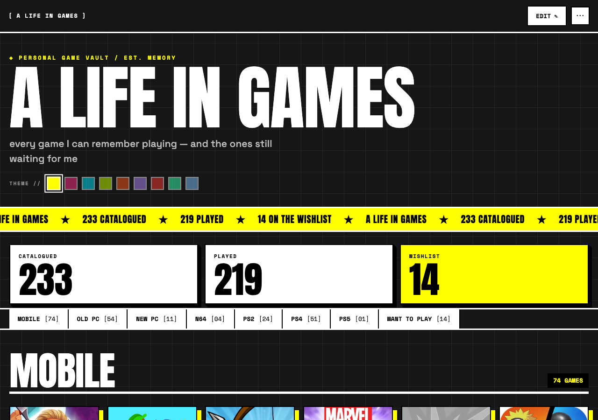

<div align="center">

# A LIFE IN GAMES

**[ PERSONAL GAME VAULT / EST. MEMORY ]**

Every game I can remember playing — and the ones still waiting for me.

[](https://adith-senthil-kumar.github.io/game-vault/)

[](#the-vault)
[](#install-it)
[](#offline)
[](#how-it-works)

### **[→ OPEN THE VAULT](https://adith-senthil-kumar.github.io/game-vault/)**



</div>

---

## THE VAULT

This is not a stats tracker. It's a **memory book** — 233 games across every
platform I've ever owned, each with its year, a plain-spoken gameplay
description, box art, and an in-game screenshot. The whole point is scrolling
through it and being teleported back.

Organized the way my gaming life actually happened — by platform:

```
MOBILE [74]   OLD PC [54]   NEW PC [11]   N64 [04]
PS2    [24]   PS4    [51]   PS5    [01]   WANT TO PLAY [14]
```

## FEATURES

|  | |
|---|---|
| **9 THEMES** | Acid Yellow to Blood Red — one tap on a swatch reskins the whole vault |
| **INSTALLABLE** | Add to Home Screen and it opens standalone, like a native app |
| **FULLY OFFLINE** | All 492 assets precached — every cover, screenshot, font, and even React |
| **EDIT IN PLACE** | One Edit toggle: add/edit/delete games and whole platform shelves |
| **CLIPS** | Any game can carry a short muted gameplay clip that plays in its detail card |
| **BACKUP / IMPORT** | The whole vault exports to one JSON file and restores anywhere |

## INSTALL IT

| Platform | How |
|---|---|
| **iPhone / iPad** | Open in Safari → Share → **Add to Home Screen** |
| **Android** | Open in Chrome → menu → **Install app** |
| **Desktop** | Chrome or Edge → install icon in the address bar |

> On iOS, install **before** editing — a Home Screen app has its own storage,
> separate from Safari.

## EDITING

Tap **EDIT** and everything becomes editable in place. Changes save to the
device instantly — text and status flips, but also uploaded covers,
screenshots, and video clips, all persisted in **IndexedDB** (they're far too
big for localStorage). If storage ever fills up, a red banner says so — a
failed save is never silent.

**⋯ → BACKUP TO FILE** exports the entire vault as JSON. **IMPORT** restores
it. **RESET TO PUBLISHED** discards local changes and returns to this repo's
`data.json`.

Nothing syncs and nothing leaves the browser. One device, one vault.

## OFFLINE

The service worker precaches all 492 assets (~73MB) on first visit — after
that the vault opens in airplane mode, in a tunnel, anywhere. That includes
the pieces static sites usually leave on CDNs:

- **React + ReactDOM** vendored in `vendor/` — byte-identical to the unpkg
  builds (SHA-384 verified against the SRI pins in `support.js`)
- **All four typefaces** (Anton, Archivo, Space Grotesk, Space Mono)
  self-hosted in `fonts/`

## HOW IT WORKS

No framework install, no bundler, no `package.json`. A static page plus data.

```
index.html      the entire app — template + logic (design by Claude Design)
data.json       233 games: name, year, genre, description, status, media paths
support.js      the template runtime
sw.js           service worker — precaches all 492 assets
images/         466 covers & gameplay screenshots (researched by Claude Cowork)
fonts/          self-hosted woff2
vendor/         React 18.3.1 UMD, pinned and verified
```

**Where the data lives:** the published collection ships in `data.json`.
Your edits live in IndexedDB and win outright on that device — push a new
`data.json` and a device with local edits keeps them until you hit
**RESET TO PUBLISHED**.

### WORKING ON IT

```bash
git clone https://github.com/Adith-Senthil-kumar/game-vault.git
cd game-vault
python3 -m http.server 8733    # any static server — the SW needs http://
```

The service worker is **cache-first**: bump `CACHE` in `sw.js`
(`game-vault-v1` → `v2`) whenever you change a file, or returning visitors
keep the old version forever. While developing, unregister the worker in
DevTools → Application, or you'll debug ghosts.

---

<div align="center">
<sub>★ A LIFE IN GAMES ★ 233 CATALOGUED ★ 219 PLAYED ★ 14 ON THE WISHLIST ★</sub>

<sub>built as a static site · designed with Claude Design · researched with Claude Cowork · covers & screenshots belong to their publishers</sub>
</div>
